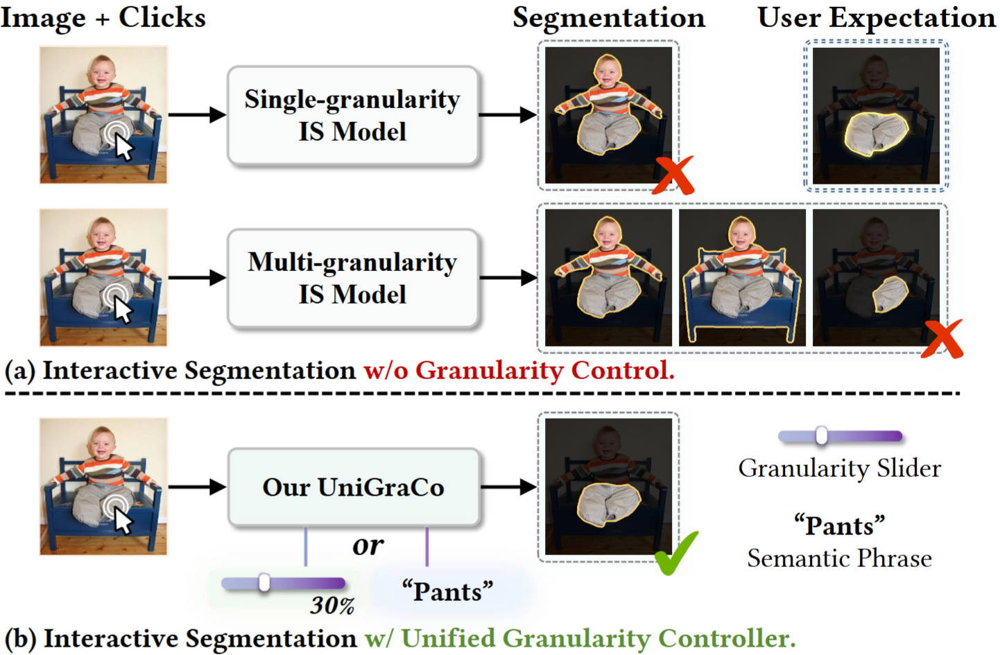

<div style="text-align: center; margin: 10px">
    <h1> ⭐ Unified Granularity Controller for Interactive Segmentation </h1>
</div>

This is the extended version of our <span style='color: #EB5353;font-weight:bold'>CVPR'24 highlight</span> paper "GraCo: Granularity-Controllable Interactive Segmentation", featuring a more comprehensive unified granularity controller, superior performance, and enhanced practicality. <br>
📣 If you are interested in the original paper, we recommend you refer to the following link: 
> [**GraCo: Granularity-Controllable Interactive Segmentation**](https://github.com/Zhao-Yian/GraCo) <br>
> Yian Zhao<sup> </sup>, Kehan Li<sup> </sup>, Zesen Cheng<sup> </sup>, Pengchong Qiao<sup> </sup>, Xiawu Zheng<sup> </sup>, Rongrong Ji<sup> </sup>, Chang Liu<sup> </sup>, Li Yuan<sup> </sup>, Jie Chen<sup> </sup> <br>
> [](https://github.com/Zhao-Yian/GraCo) [](https://arxiv.org/abs/2405.00587) [](https://zhao-yian.github.io/GraCo)


## 💡 Introduction
Interactive Segmentation (IS) segments specific objects or parts based on user input, deducing human intent from sparse input prompts.
However, the sparse-to-dense mapping is ambiguous, making it challenging for users to obtain segmentations at the desired granularity and causing them to engage in trial-and-error cycles.
Although existing multi-granularity IS models (e.g., SAM) alleviate the ambiguity of single-granularity methods by predicting multiple masks simultaneously, this approach has limited scalability and produces redundant results.
To address this issue, we introduce a creative granularity-controllable IS paradigm that resolves ambiguity by allowing users to precisely control the segmentation granularity.
Specifically, we propose a unified Granularity Controller (UniGraCo) that supports multi-type optional granularity control signals to pursue unified control over diverse segmentation requirements, 
effectively overcoming the limitation of single-type control in adapting to different needs, thus boosting the system's efficiency and practicality.
To mitigate the excessive cost of annotating multi-grained masks and corresponding granularity control signals for training UniGraCo, we construct an automated data engine capable of generating high-quality and granularity-abundant mask-granularity data pairs at low cost.
To enable UniGraCo to learn unified granularity controllability in an efficient and stable manner, we further design a granularity-controllable learning strategy. 
This strategy leverages the generated data pairs to incrementally equip the pre-trained IS model with granularity controllability while preserving its segmentation capability.
Our UniGraCo has significant advantages over previous methods, highlighting its potential as a practical interactive tool.

<div align="center">
  
</div>

## 🚀 Quick start

### 📍 Install
- Install [torch](https://pytorch.org/get-started/previous-versions/)
```bash
# Install torch (according to your own cuda version, take 11.8 as an example)
pip install torch==2.0.1 torchvision==0.15.2 torchaudio==2.0.2 --index-url https://download.pytorch.org/whl/cu118
```

- Install other dependencies

```bash
# Install other dependencies
pip install -r requirements.txt
```

### 🍇 Our interactive demo

```bash
# running on cpu
python demo.py --checkpoint path/to/weights/sbd_vit_base.pth --lora_checkpoint path/to/GraCo_base_lora.pth --cpu

# running on gpu
python demo.py --checkpoint path/to/weights/sbd_vit_base.pth --lora_checkpoint path/to/GraCo_base_lora.pth --gpu 0

```


### 🏕️ Fine-grained Mask Generator (Optional)

- If you do not use the automatically generated pseudo mask proposals, simply remove `--part_path` in the training command.

```bash
python fine_grained_mask_generator.py --checkpoint weights/simpleclick/sbd_vit_base.pth  \
    --save-path part_output --save-name proposal.pkl --dataset-path /path/to/datasets/SBD/dataset
```

### 🦄 Train and Evaluation

- Download pre-trained weights and place them in `./weights/simpleclick/`

[SimpleClick models](https://drive.google.com/drive/folders/1qpK0gtAPkVMF7VC42UA9XF4xMWr5KJmL?usp=sharing)

- Train

```bash
bash train.sh
```

- Evaluation on Instance-level, Part-level, Out-of-domain benchmarks
```bash
bash eval.sh
```

- Complementarity analysis of two types of granularity control signals
```bash
bash analysis.sh
```

## Acknowledgements
This repository is built upon [SimpleClick](https://github.com/uncbiag/SimpleClick).
Thank the authors of these open source repositories for their efforts. And thank the ACs and reviewers for their effort when dealing with our paper.

## ✨ Citation
If you find this repository helpful, please consider citing our paper.

```
@inproceedings{zhao2024graco,
  title={GraCo: Granularity-Controllable Interactive Segmentation},
  author={Zhao, Yian and Li, Kehan and Cheng, Zesen and Qiao, Pengchong and Zheng, Xiawu and Ji, Rongrong and Liu, Chang and Yuan, Li and Chen, Jie},
  booktitle={Proceedings of the IEEE/CVF Conference on Computer Vision and Pattern Recognition},
  pages={3501--3510},
  year={2024}
}
```